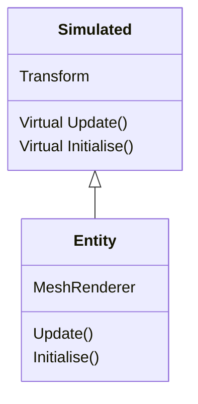

Project by, Thomas Jacobs | S212046.
 # Programming for Graphics  
 
**Introduction**
>Here, on this document you will find a brief description and general overview of the project that I have submitted for the 'programming for graphics' module. Please, use the documentation in the main folder for a more technical synopsis on the programs I have written for this project.

## Simulation
**Introduction**
>When writing the fundemental implementation for the area's within this module, I decided that I wanted to build an interactable environment with a heavy emphasis on the visualisation of each technique. To do this I had to make some modifications to the base implementations of certain classes so that they could provide more dynamic attributes during runtime.

**Essentials**
>**Simulated**
>The simulated class is an interface that provides the essential attributes that are required for simulation. All simulated objects have a transform to represent their position, rotation and scale in world space. It should also be noted that simulated objects are not confined to having a visual representation.

>**Entity**
>An instance of the entity class is a simulated object with the distinct difference that it comes packaged with several predefined, 'visual' attributes such as, a mesh-renderer. Whenever, you see an instance of the 'entity' class in my project, the program is simply defining a simulated object that must evoke some form of visualisation within the simulated world space.
