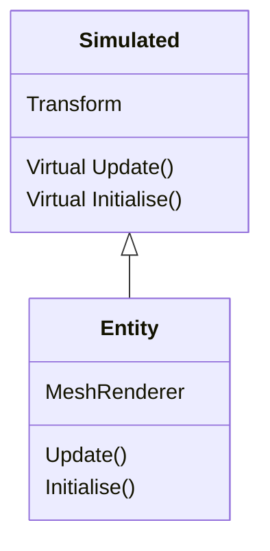

Project by, Thomas Jacobs | S212046.
 # Programming for Graphics  
 
**Introduction**
>Here, on this document you will find a brief description and general overview of the project that I have submitted for the 'programming for graphics' module. Please, use the documentation in the main folder for a more technical synopsis on the programs I have written for this project.

## Simulation
**Introduction**  
>When writing the fundemental implementation for the area's within this module, I decided that I wanted to build an interactable environment with a heavy emphasis on the visualisation of each technique. To do this I had to make some modifications to the base implementations of certain classes so that they could provide more dynamic attributes during runtime.

**Essentials**  
>**Simulated**  
>The simulated class is an interface that provides the essential attributes that are required for simulation. All simulated objects have a transform to represent their position, rotation and scale in world space. It should also be noted that simulated objects are not confined to having a visual representation.

>**Entity**  
>An instance of the entity class is a simulated object with the distinct difference that it comes packaged with several predefined, 'visual' attributes such as, a mesh-renderer. Whenever, you see an instance of the 'entity' class in my project, the program is simply defining a simulated object that must evoke some form of visualisation within the simulated world space.

>**Extension**
>The extension class is an interface that provides several methods for execution during runtime, when applied to a simulated instance. Extensions allow simulated objects to have reusable, dynamic customisation that can be allowcated or deallocated during runtime. Overall, the class is designed to extend the base properties of a simulated object.

**Controls**
>**Camera**
>The main camera (simulated object) comes with one vital extension pre-applied to allow for movement during the projects runtime.
>
>***Move Left*** : Key A
>***Move Right*** : Key D
>***Move Up*** : Key Q
>***Move Down*** : Key E
>***Move Forward*** : Key W
>***Move Backward*** : Key S
>***Rotate Camera*** : Mouse (Mouse Delta Position)
>***Freeze Camera Movement*** Left-Shift

**User Interface**  
>Also featured in my project is a simple user interface, providing some basic functionality for interacting with the simulated environment.  
>
>**Inspector**  
The inspector window; by default, located on the left side of the screen will provide you 'public', information about the currently selected ('simulated' instance) object. It is in this window where you will also be able to adjust certain attributes of a simulated instance such as it's (three vector) position in 'world-space'.

>**Hierarchy**  
The hierarchy window displays all of the currently present instances of simulated objects during runtime. By clicking the drop-down for any present instance of simulated-objects, you will then be met with the option to select the object which will display it's public attributes in the inspector window.

**Conclusion**
>**Implemented Fundementals**
>In my project you will find the following fundementals relevant to this module.
> * Textures.
> * Meshes.
> * Cameras.
>  * Moveable Cameras ('CameraController' extension).
> * Shaders.
> * Materials (Also known as substances in my project).
> * Normal Mapping.
> * Directional Lighting.
> * Phong Lighting.
> * Animation (Also known as an 'animator' in my project).
> * User Interface.
> * Model loading.
> * Material / Texture loading.
